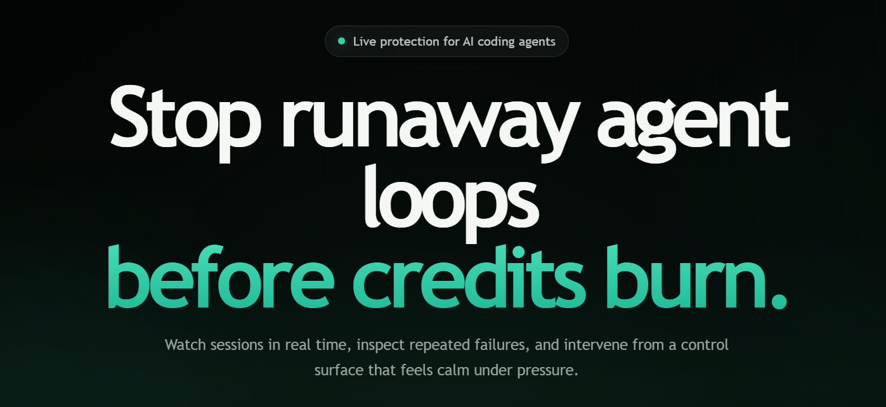
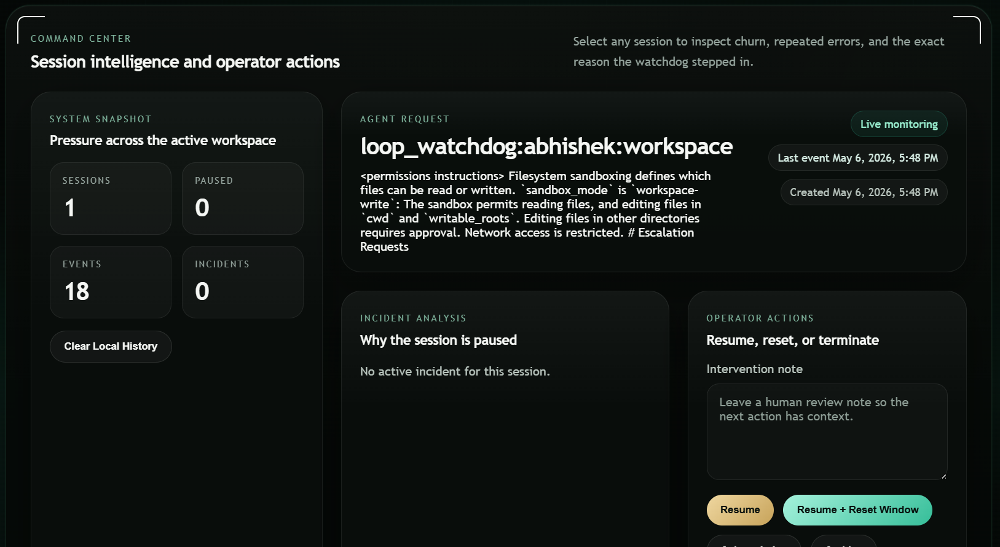
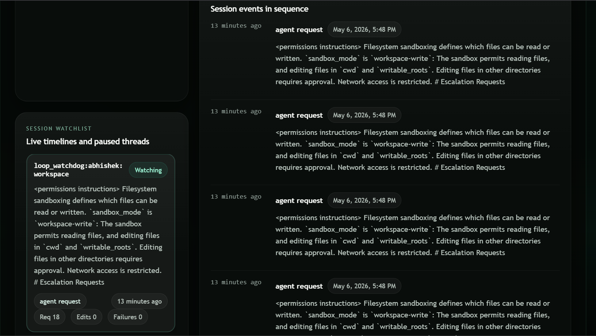

#  𓃡 Loop Watchdog
Loop Watchdog is a runaway-agent kill switch for AI coding sessions.  

[](https://www.python.org/downloads/)
[](https://fastapi.tiangolo.com/)
[](https://workers.cloudflare.com/)
[](LICENSE)
[](#architecture)
[](#what-the-proxy-detects)

 It sits in front of an OpenAI-compatible model endpoint, watches the session for repeated fix-break behavior, pauses the next model call before more credits burn, and pushes a structured alert to Slack, email, or your own control plane.

The first version in this repository ships two real pieces:

- A local Python watchdog proxy that coding agents can target as their `base_url`
- A Cloudflare Worker control plane that ingests incidents, stores them in D1, and fans them out to Slack or email

## Why This Exists

The failure mode is simple:

1. An agent edits a file
2. Tests fail in a similar way
3. The agent retries with nearly the same patch
4. Tokens keep burning while the session makes no meaningful progress

Loop Watchdog turns that failure mode into an explicit product boundary. It tracks repeated request patterns, repeated file churn, repeating error families, and edit-error oscillation. When the score crosses a threshold, the session is paused and an incident is raised.  

## Architecture

```text
IDE agent / CLI wrapper
        |
        v
Loop Watchdog proxy (FastAPI)
        |
        +--> in-memory session graph
        |        |
        |        +--> loop detector
        |        +--> pause / resume / kill state
        |
        +--> incident dispatcher
        |        |
        |        +--> Cloudflare Worker
        |                 |
        |                 +--> D1 incident store
        |                 +--> Slack webhook
        |                 +--> Resend email
        |
        +--> upstream provider (Gemini / OpenAI-compatible endpoint)
```

## What The Proxy Detects

- High-overlap retries across adjacent agent requests
- The same files being churned repeatedly with no success signal
- Repeating failure signatures after normalization
- Edit -> error -> edit -> error oscillation on the same files
- Growing request volume without a passing test or explicit recovery event

The detector is intentionally rule-based for v1. It is deterministic, cheap to run locally, and easy to tune from real operator feedback.

## Quick Start

For a Codex user, the easiest path is:

```bash
loop-watchdog start codex
```

Run that from the root of the repo you want to work in. Loop Watchdog will start the local server if needed, launch Codex through the proxy, and keep watching while you build.

### 1. Install the Python service

```bash
python -m venv .venv
. .venv/Scripts/activate
pip install -e .
```

### 2. Configure the local proxy

For Codex with the default OpenAI upstream, you can often skip this entirely. The proxy already defaults to `https://api.openai.com` and forwards the incoming Codex auth header upstream.

You only need extra configuration when you want custom alerting, a non-default upstream, or different detector tuning.

Create `.env` from the example values below:

```env
LOOP_WATCHDOG_UPSTREAM_BASE_URL=https://generativelanguage.googleapis.com
LOOP_WATCHDOG_UPSTREAM_API_KEY=replace-me
LOOP_WATCHDOG_UPSTREAM_AUTH_MODE=x-api-key
LOOP_WATCHDOG_ALERT_WEBHOOK_URL=https://your-worker.example.workers.dev/api/incidents
LOOP_WATCHDOG_ALERT_HMAC_SECRET=replace-me
LOOP_WATCHDOG_PERSISTENCE_PATH=.loop_watchdog/state.json
LOOP_WATCHDOG_PAUSE_SCORE_THRESHOLD=4.8
```

### 3. Start building from any repo

```bash
cd path/to/your-project
loop-watchdog start codex
```

That single command:

- starts the local watchdog server if it is not already running
- points Codex at `http://127.0.0.1:8787/v1`
- preserves Codex's OpenAI authentication flow
- generates a stable session id like `repo:user:branch`
- injects that id as `X-Loop-Session`
- emits lightweight `file_edit` events while Codex is active

You can still pass normal Codex arguments through the wrapper:

```bash
loop-watchdog start codex "Fix the failing parser test"
loop-watchdog start codex exec "Investigate why totals are still rounding wrong"
loop-watchdog start codex -m gpt-5.5
```

If you want to inspect the exact Codex command before launch:

```bash
loop-watchdog start codex --dry-run
```

If Codex is installed but Windows path lookup is flaky, pass the executable explicitly:

```bash
loop-watchdog start codex --codex-executable "C:\Users\you\.vscode\extensions\openai.chatgpt-...\bin\windows-x86_64\codex.exe"
```

### 4. Open the dashboard

```text
http://127.0.0.1:8787/dashboard
```

The dashboard shows live sessions, paused incidents, recent event timelines, and operator controls for acknowledge, resume, reset, archive, and kill actions.

If you want to start fresh, use the dashboard's `Clear Local History` button before your next run.

### 5. Manual server mode

If you prefer the older two-terminal setup, you can still run the server yourself:

```bash
loop-watchdog serve --host 127.0.0.1 --port 8787
```

The landing page is also still available at:

```text
http://127.0.0.1:8787/
```

### 6. Point another agent to the proxy manually

Any other tool that supports an OpenAI-compatible `base_url` can target `http://127.0.0.1:8787/v1`.

For best detection, send a stable session identifier on each request:

```text
X-Loop-Session: repo-name:user-or-agent:branch
```

If a resumed session requires a changed plan, send it on the next request as either:

```text
X-Loop-Plan: rewritten plan text
```

or:

```json
{
  "metadata": {
    "loop_watchdog_plan": "rewritten plan text"
  }
}
```

### 7. Optionally emit richer local events

The `loop-watchdog start codex` launcher already emits basic `file_edit` events automatically. The proxy still gets much better when an IDE extension or wrapper also reports structured test failures and richer edit context:

```http
POST /v1/watchdog/events
Content-Type: application/json

{
  "session_id": "repo:user:branch",
  "kind": "file_edit",
  "summary": "Retrying parser fix after test failure",
  "files": ["src/parser.py", "tests/test_parser.py"],
  "metadata": {
    "diff_excerpt": "@@ parse_user @@",
    "attempt": 4
  }
}
```

## Real Loop Test

If you want to test the actual "stop the retry before more credits burn" path without wiring a full client first:

1. Start the watchdog server.
2. Open the dashboard and clear local history.
3. Run:

```powershell
powershell -ExecutionPolicy Bypass -File .\scripts\test-loop-watchdog.ps1
```

The script posts repeated `file_edit` and `test_failure` events for one session, then sends a model request through `/v1/chat/completions`. The expected result is an HTTP `409` pause response, which means the watchdog blocked the next model call before it could be forwarded upstream.

## Real User Flow

For the closest v1 product test with a human and Codex in the loop:

1. Install `loop-watchdog` once.
2. Open the repo you actually want to work in.
3. Run `loop-watchdog start codex`.
4. Open `http://127.0.0.1:8787/dashboard`.
5. Work normally in Codex.
6. Keep the dashboard open to watch requests, file churn, pauses, and incident reasons.

This is the easiest real-user path in the repo today. It removes the manual `base_url`, server startup, and session-header setup, but automatic test-pass and test-failure telemetry is still a next-step integration.

## Watchdog Endpoints

- `GET /`
- `GET /dashboard`
- `GET /v1/watchdog/dashboard`
- `POST /v1/watchdog/demo/guided-trial`
- `POST /v1/watchdog/history/clear`
- `POST /v1/chat/completions`
- `POST /v1/responses`
- `POST /v1/watchdog/events`
- `GET /v1/watchdog/sessions`
- `GET /v1/watchdog/sessions/{session_id}/events`
- `GET /v1/watchdog/status/{session_id}`
- `POST /v1/watchdog/sessions/{session_id}/acknowledge`
- `POST /v1/watchdog/sessions/{session_id}/resume`
- `POST /v1/watchdog/sessions/{session_id}/archive`
- `POST /v1/watchdog/sessions/{session_id}/kill`
- `GET /healthz`

## Cloudflare Worker

The Worker receives incidents from the proxy, stores them in D1, and can fan them out to Slack and email.

### Worker setup

```bash
cd apps/control-plane
npm install
npm run db:migrate
npm run deploy
```

Environment variables are documented in [apps/control-plane/.dev.vars.example](</E:/VsCode_/loop_Watchdog/apps/control-plane/.dev.vars.example>).

## Development

```bash
python -m pytest
python -m compileall src tests
```
# dashboard view



## Design Notes

- The proxy is intentionally local-first. A developer can run it without creating a cloud account.
- Incidents are serialized with enough context to power a future dashboard without reworking the schema.
- The detector is built around explainable signals so the pause decision can be surfaced to humans without hand-waving.
- Session state persists locally by default, so incidents and operator notes survive a restart.
- The dashboard can enforce a changed-plan token before a resumed session is allowed to spend again.
- The landing page keeps the live dashboard clean by default, while guided trial can create a realistic paused session on demand.

The next product layer after this repo is a native editor wrapper that emits richer diff and test telemetry automatically. This codebase is designed so that layer can plug into the existing event API without replacing the core.
